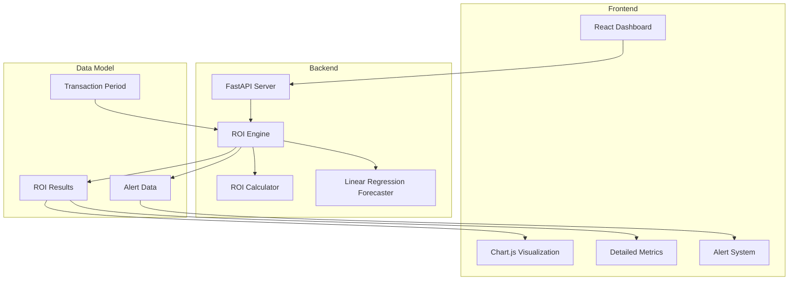
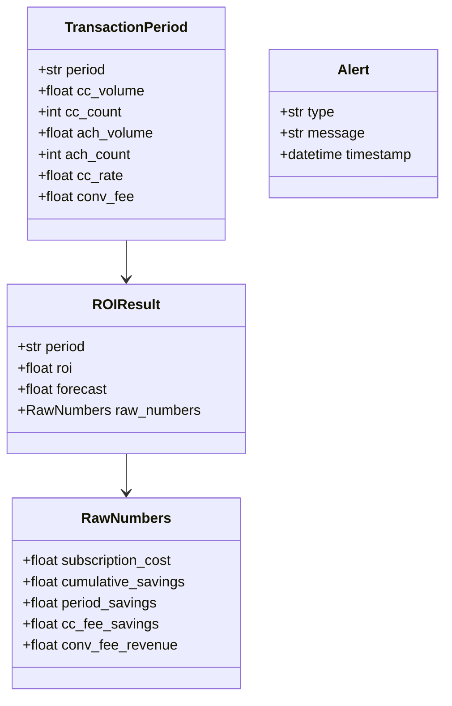
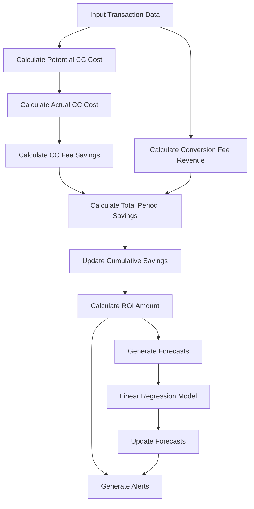
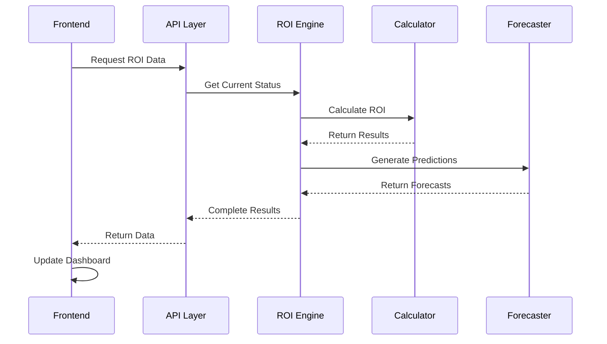

# ROI Tracking System - Architecture & Approach

## System Overview

## Data Model

## Calculation Flow

## System Approach

1. **Data Collection**
   - Collect transaction data per period
   - Track credit card and ACH volumes
   - Monitor processing fees and rates

2. **ROI Calculation**
   - Calculate potential costs (if all transactions were CC)
   - Calculate actual costs (with ACH adoption)
   - Compute savings from fee differentials
   - Track cumulative savings against subscription cost

3. **Forecasting**
   - Use linear regression for trend analysis
   - Project future ROI based on historical data
   - Update forecasts as new data arrives

4. **Alert System**
   - Monitor ROI trajectory
   - Track progress towards break-even
   - Provide real-time status updates
   - Alert on concerning trends

5. **Visualization**
   - Real-time dashboard updates
   - Interactive data exploration
   - Detailed period metrics
   - Clear status indicators

## Key Components

### ROI Engine
- Core calculation engine
- Manages transaction periods
- Calculates ROI metrics
- Generates forecasts
- Produces alerts

### API Layer
- RESTful endpoints
- Real-time data access
- Period management
- Status reporting

### Frontend Dashboard
- Interactive visualization
- Real-time updates
- Detailed metrics display
- Alert management

## Data Flow

